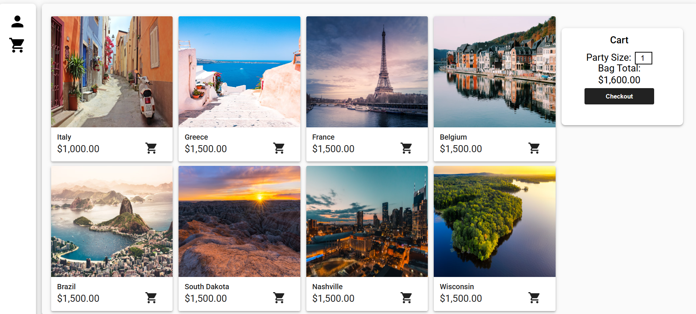
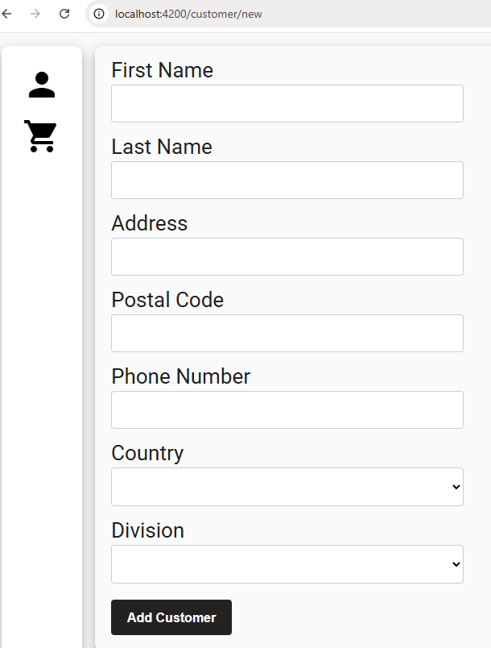

# Full-Stack Travel Ecommerce Shop

## **Live Demo:**
### [https://travelapp-damp-shape-6592.fly.dev/customer](https://travelapp-damp-shape-6592.fly.dev/customer)

## 🚀 Project Highlights
- Modern travel booking app (Angular + Spring Boot)
- Secure checkout with order tracking
- Responsive UI (Angular Material)
- RESTful backend, MySQL database
- Docker-ready for cloud deployment

## 🛠️ Tech Stack


## 📸 Screenshots


Full-stack travel shopping app. The frontend (Angular) lets users browse vacations and excursions, manage a cart, and place orders. The backend (Spring Boot + MySQL) exposes REST APIs, persists data, and enforces referential integrity with cascading deletes.

## Tech Stack
- Frontend: Angular 14, Angular Material, Angular CDK, Flex Layout, RxJS, TypeScript
- Backend: Spring Boot 3, Spring Data JPA, Spring Data REST, Bean Validation (Jakarta Validation)
- Database: MySQL 8 (InnoDB), SQL schema + seed scripts
- Build/Tooling: Maven, Node.js + npm, Angular CLI, TypeScript, Karma/Jasmine

## Project Structure
- `client/` – Angular app (UI, services, models)
- `demo/` – Spring Boot app (REST controllers, JPA entities, services)

## Backend Structure (prioritized)
- `demo/src/main/resources/application.properties` – MySQL connection and Spring settings
- `demo/src/main/java/com/assessment/demo/controllers/` – REST endpoints
  - `CustomerController` (`/api/customers`) – CRUD + DELETE cascades via DB
  - `VacationController` (`/api/vacations`) – list vacations
  - `ExcursionController` (`/api/excursions`) – list excursions
  - `CheckoutController` (`/api/checkout/purchase`) – place order
- `demo/src/main/java/com/assessment/demo/entities/` – JPA entities mapped to tables
  - `Customer`, `Cart`, `CartItem`, `Vacation`, `Excursion`, `Division`, `Country`, `StatusType`
  - Relationships:
    - `Customer (1) -> (many) Cart` (FK: `carts.customer_id`)
    - `Cart (1) -> (many) CartItem` (FK: `cart_items.cart_id`)
    - `CartItem (many) <-> (many) Excursion` via join table `excursion_cartitem`
    - `Vacation (1) -> (many) Excursion` (FK: `excursions.vacation_id`)
- `demo/src/main/java/com/assessment/demo/dao/` – Spring Data repositories
  - `CustomerRepository`, `CartRepository`, `CartItemRepository`, etc.
- `demo/src/main/java/com/assessment/demo/services/` – Business logic (checkout flow)
  - `CheckoutService`, `CheckoutServiceImpl`, `Purchase`, `PurchaseResponse`

Key backend details to replicate
- DB: MySQL 8 on `localhost:3306` with schema `full-stack-ecommerce`
- Credentials: set in `application.properties` (`spring.datasource.*`)
- Hibernate DDL: `spring.jpa.hibernate.ddl-auto=none` (DB created via SQL scripts or manually)
- Base path: `spring.data.rest.base-path=/api` (all endpoints start with `/api`)
- Cascades: ensure DB FKs use `ON DELETE CASCADE` for:
  - `carts.customer_id` → customers.customer_id
  - `cart_items.cart_id` → carts.cart_id
  - `excursion_cartitem.cart_item_id` → cart_items.cart_item_id

## Frontend Structure
- `client/src/app/views/` – Routed pages (customers, vacations, excursions, cart)
  - `view-customer/` – list, delete, and navigate to detail/edit
  - `add-customer/`, `edit-customer/` – CRUD forms
  - `vacation/`, `excursion/`, `excursion-detail/` – browse/select
  - `cart/`, `cart-summary/`, `order-confirmation/`
- `client/src/app/services/` – Shared services
  - `purchase-data.service.ts` – in-memory cart and checkout data
- `client/src/app/model/` – Typed models and API response shapes
  - DTOs under `model/dto/`
- `client/src/environments/` – API base URL and environment flags
- Dev proxy: `client/proxy.conf.json` routes `/api` → `http://localhost:8080`

Key frontend details to replicate
- Angular CLI v14 project, `ng serve` uses proxy for `/api`
- API calls target relative paths like `/api/customers`
- Delete customer calls `DELETE /api/customers/{id}` and refreshes the list on success

## Key Features
- View vacations, excursion details, and pricing
- Add excursions to a cart, update party size, see package total
- Customer CRUD (add, view, edit, delete)
- Checkout flow posts a purchase to the backend
- Proxy setup for local dev: Angular `/api` → Spring Boot on port 8080
- Safe deletes: DB-level ON DELETE CASCADE from customers → carts → cart_items → excursion_cartitem



## APIs (examples)
- `GET /api/customers` – list customers
- `GET /api/customers/{id}` – get a customer
- `POST /api/customers` – create (DTO expected)
- `PUT /api/customers/{id}` – update
- `DELETE /api/customers/{id}` – delete (cascades through carts/items)
- `GET /api/vacations`, `GET /api/excursions` – browse data
- `POST /api/checkout/purchase` – place an order

## ⚡ Quick Start
```bash
# Backend
cd demo
mvn spring-boot:run

# Frontend
cd ../client
npm install
ng serve --proxy-config proxy.conf.json
```
Backend: http://localhost:8080
Frontend: http://localhost:4200
API calls to `/api/...` are proxied to the backend

## Common Commands
Frontend
```bash
cd client
npm install
ng serve --proxy-config proxy.conf.json
ng build
ng test
```
Backend
```bash
cd demo
mvn spring-boot:run
mvn test
```


## Database Setup Options
- Use existing local MySQL schema (recommended for dev). Ensure these FKs have cascades:
  - `carts.customer_id` → customers.customer_id ON DELETE CASCADE
  - `cart_items.cart_id` → carts.cart_id ON DELETE CASCADE
  - `excursion_cartitem.cart_item_id` → cart_items.cart_item_id ON DELETE CASCADE
- Or initialize from SQL scripts:
  - Copy a schema file into `demo/src/main/resources/database/schema.sql`
  - In `application.properties` set:
    ```properties
    spring.jpa.hibernate.ddl-auto=none
    spring.sql.init.mode=always
    spring.sql.init.schema-locations=classpath:database/schema.sql
    ```
  - Restart the backend; Spring Boot will run the script


# 💡 Why This Project?
- Built full-stack CRUD with real-world patterns
- Learned database cascade deletes, CORS, and deployment
- Built an e-commerce replica that focused on a fun, travel-themed workflow.
- Wanted to dive deeper into Angular integration with the backend.
- Overall, it solves a problem, which I highly value.


## Developer Tips
- Angular environment: `client/src/environments/environment.ts`
- Proxy: `client/proxy.conf.json` (already wired in `angular.json` dev serve)
- Data models/DTOs: `client/src/app/model` and `client/src/app/model/dto`
- Purchase data service (cart state): `client/src/app/services/purchase-data.service.ts`
- Controllers (backend): `demo/src/main/java/com/assessment/demo/controllers`
- Entities (backend): `demo/src/main/java/com/assessment/demo/entities`


# Deploying to Fly.io (PostgreSQL + Angular + Spring Boot)

## 1. Prerequisites
- Fly CLI installed: https://travelapp-damp-shape-6592.fly.dev/customer
- Account logged in:
```
fly auth login
```
- PostgreSQL launch (managed) after app bootstrap.

## 2. First-time init
From repository root:
```
fly launch --no-deploy
```
When prompted:
- Use existing Dockerfile: yes
- Set app name (or keep generated)
- Do NOT create a Postgres DB yet (we'll attach after confirming build) *or* allow wizard to create it; either works.


# ---

#  🚀 Deployment & Supabase Setup
#
This app is deployed on [Fly.io](https://fly.io/) and uses [Supabase](https://supabase.com/) for free PostgreSQL hosting.
#
# **Supabase Setup:**
 - Create a new Supabase project and database.
 - Run the provided SQL seed script to initialize schema and sample data.
#- Copy your Supabase connection string, username, and password.

# **Fly.io Deployment:**
#- The backend and frontend are bundled together using a multi-stage Dockerfile.
#- Environment variables for database connection (`SPRING_DATASOURCE_URL`, `SPRING_DATASOURCE_USERNAME`, `SPRING_DATASOURCE_PASSWORD`) are set in Fly.io secrets to connect to Supabase.


# **Live Demo:**
- [https://travelapp-damp-shape-6592.fly.dev/customer](https://travelapp-damp-shape-6592.fly.dev/customer)


